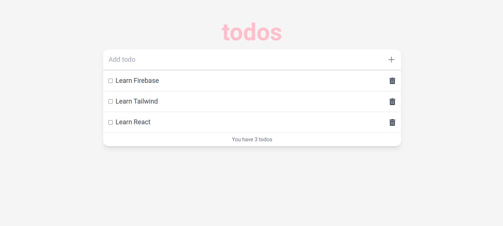

# Todo app v2

# Todo application.

## Overview

This is a Todo application that has CRUD functionality. A user can Add, Edit, Delete and Read(view) todos.

### Built with

- [React](https://reactjs.org/) - JS library
- [TailwindCSS](https://tailwindcss.com/) - CSS framework
- [Firebase](https://reactjs.org/) - A set of backend cloud computing services & app development platforms.
